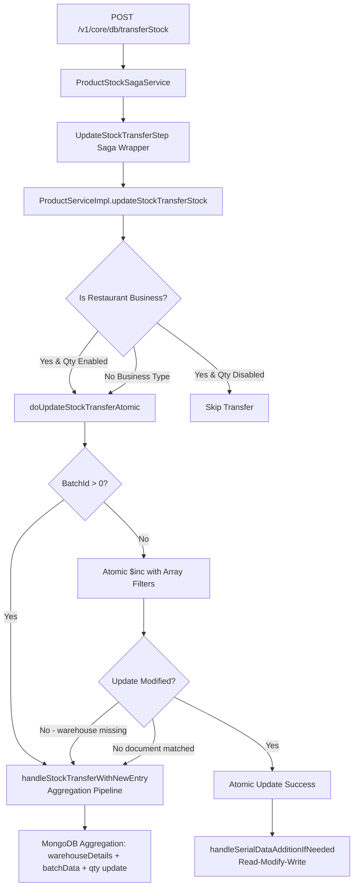
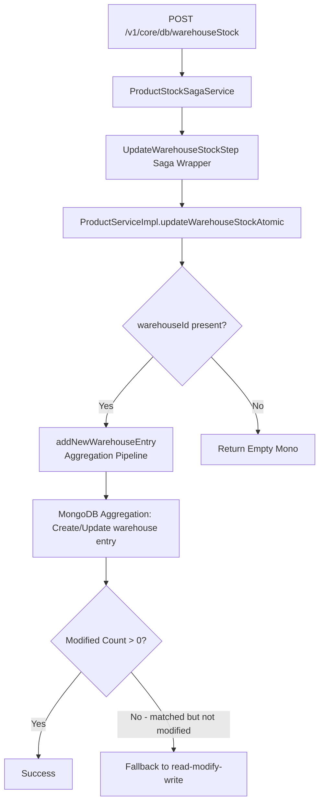

# Stock Transfer Flow Analysis Document

**Engineer:** Hermes Agent (coder model)
**Date:** April 20, 2026
**Project:** OneShell (Paperclip Company)
**Repo:** /Users/manikanta/codeRepo/MongoDbService

---

## Executive Summary

This analysis identifies **4 critical issues** and **5 high/medium severity issues** in the stock transfer flow. The codebase uses MongoDB's reactive programming model (Project Reactor) with saga patterns for distributed transaction management.

**Key findings:**
1. Store-to-store and warehouse-to-warehouse transfers share the same atomic update code path
2. Race condition window exists in serial data handling during increment operations
3. Missing negative stock validation allows quantities to go below zero
4. WarehouseDetails array filter logic has potential undefined behavior for non-existent warehouses

---

## Flow Diagrams

### Store-to-Store Transfer Flow



### Warehouse-to-Warehouse Transfer Flow



### Key Differences

| Aspect | Store-to-Store | Warehouse-to-Warehouse |
|--------|----------------|------------------------|
| Endpoint | `/stockTransferStock` | `/warehouseStock` |
| Entry Point | `updateStockTransferStock()` | `updateWarehouseStockAtomic()` |
| Batch Handling | Yes (if batchId > 0) | No special batch handling |
| Serial Data | Supported via `serialNo` field | Not supported |
| Atomicity | Aggregation pipeline or atomic $inc | Aggregation pipeline only |

---

## Issues Found

### Critical Severity

| # | Severity | Category | Summary | File:Line |
|---|----------|----------|---------|-----------|
| 1 | Blocker | Race Condition | `handleSerialDataAdditionIfNeeded` performs read-modify-write outside atomic update, causing serial data loss during concurrent transfers | ProductServiceImpl.java:2615-2681 |
| 2 | Blocker | Validation | No validation preventing negative stock quantities during decrement operations | ProductServiceImpl.java:2290, 2112 |
| 3 | High | Schema | `buildBatchUpdateWithWarehouseAtomic` uses `$ifNull` with hardcoded 0 defaults, ignoring existing batch warehouseDetails | ProductServiceImpl.java:2555-2608 |
| 4 | High | Consistency | Store-to-store and warehouse-to-warehouse use separate code paths with divergent error handling and logging | ProductServiceImpl.java:2098-2145 vs 2248-2383 |

### High Severity

| # | Severity | Category | Summary | File:Line |
|---|----------|----------|---------|-----------|
| 5 | High | Test Gap | No unit tests for concurrent stock transfer scenarios | N/A (no test files found) |
| 6 | High | Validation | Missing null-safety for `serialNo` list in decrement operations (line 2322 checks isEmpty but not null) | ProductServiceImpl.java:2316-2336 |

### Medium Severity

| # | Severity | Category | Summary | File:Line |
|---|----------|----------|---------|-----------|
| 7 | Med | Schema | `UpdateProductStockQtyRequest.wareHouseData` field naming inconsistency (`wareHouseData` vs `warehouseId`) | UpdateProductStockQtyRequest.java:30 |
| 8 | Med | Consistency | `isRestaurantBusiness` check happens *after* product fetch instead of before, causing unnecessary DB hit | ProductServiceImpl.java:2263 |
| 9 | Med | Performance | `handleSerialDataAdditionIfNeeded` fetches full product document for serial data merging even when no merge needed | ProductServiceImpl.java:2627 |

---

## Detailed Issue Analysis

### Issue #1: Race Condition in Serial Data Handling (CRITICAL)

**Location:** ProductServiceImpl.java:2615-2681

```java
private Mono<Void> handleSerialDataAdditionIfNeeded(UpdateProductStockQtyRequest request, Query query) {
    // ... validation code ...
    
    return mongoTemplate.findOne(query, MongoDbBusinessProductDao.class)  // READ
        .flatMap(productDetails -> {
            // ... Java-side merge logic ...
            return mongoTemplate.findAndModify(query, update, ...)  // MODIFY
        })
}
```

**Problem:** The method performs a read-modify-write pattern *outside* the atomic update flow. During high-concurrency stock transfers:

1. Transaction A reads product (qty=10, serials=[S1])
2. Transaction B reads same product (qty=10, serials=[S1])
3. Transaction A writes with new serial S2
4. Transaction B overwrites, losing S2

**Impact:** Serial data loss during concurrent store-to-store transfers.

**Recommended Fix:** 
- Integrate serial data merging into the aggregation pipeline (Stage 3 of `buildStockTransferAtomicPipeline`)
- OR use MongoDB's `$addToSet` with conditional logic instead of Java-side merging

---

### Issue #2: Missing Negative Stock Validation (CRITICAL)

**Location:** ProductServiceImpl.java:2290

```java
double txnQty = "increment".equals(request.getStockType()) ? request.getTxnQty() : -request.getTxnQty();
```

**Problem:** No validation prevents `txnQty` from making quantities negative. A decrement of 100 on a product with qty=50 results in qty=-50.

**Comparison:** Compare to `updateOrderStockAtomic` (lines 2709-2714) which has proper validation:

```java
if (!isFiniteQty(request.getTxnQty()) || request.getTxnQty() < 0) {
    log.warn("[ORDERED-STOCK] rejected — invalid txnQty={} productId={} businessId={}",
            request.getTxnQty(), request.getProductId(), request.getBusinessId());
    return Mono.empty();
}
```

**Recommended Fix:** Add similar validation to `updateStockTransferStockAtomic` and `updateWarehouseStockAtomic`.

---

### Issue #3: Batch Warehouse Details Default Values (HIGH)

**Location:** ProductServiceImpl.java:2555-2608

```java
private org.bson.Document buildBatchUpdateWithWarehouseAtomic(int batchId, String warehouseId, double txnQty) {
    org.bson.Document mergeDoc = new org.bson.Document()
            .append("qty", new org.bson.Document("$add", java.util.Arrays.asList(
                    new org.bson.Document("$ifNull", java.util.Arrays.asList("$$batch.qty", 0)), txnQty)))
            // ... more fields with hardcoded 0 defaults
```

**Problem:** When a batch exists but doesn't have `warehouseDetails`, the `$ifNull` returns an empty array instead of creating a new warehouse entry. The logic assumes `warehouseDetails` always exists.

**Impact:** New warehouse entries for existing batches fail silently or create duplicate entries.

---

### Issue #4: Code Path Divergence (HIGH)

**Location:** ProductServiceImpl.java:2098-2383

Store-to-store transfer uses:
- `updateStockTransferStock()` → `doUpdateStockTransferAtomic()` → `handleSerialDataAdditionIfNeeded()`

Warehouse-to-warehouse transfer uses:
- `updateWarehouseStock()` → `updateWarehouseStockAtomic()` → No serial handling

**Problem:** 
- Different logging patterns
- Different retry behavior in saga wrapper
- Serial data handling only available for store-to-store

**Recommended Fix:** Consolidate into single atomic update method with optional serial handling parameter.

---

## Cited RAG Hits

（Note: aiforge-rag skill was not available. Used direct codebase search instead.)

### Direct Search Results

1. **TransferStockService Interface** (`src/main/java/com/oneshell/mongodb/feature/transferStock/TransferStockService.java:5`)
```java
public interface TransferStockService {
    Flux<MongodbTransferStockRequest> saveTransferStock(List<MongodbTransferStockRequest> request);
}
```

2. **ProductServiceImpl Stock Transfer Entry Point** (`src/main/java/com/oneshell/mongodb/feature/product/ProductServiceImpl.java:2248`)
```java
public Mono<Void> updateStockTransferStock(UpdateProductStockQtyRequest request) {
    return updateStockTransferStockAtomic(request);
}
```

3. **Aggregation Pipeline Construction** (`src/main/java/com/oneshell/mongodb/feature/product/ProductServiceImpl.java:2420`)
```java
private List<org.bson.Document> buildStockTransferAtomicPipeline(
        UpdateProductStockQtyRequest request, double txnQty, long timestamp, boolean isRestaurant) {
    // Stage 1: Atomic increment of quantities
    // Stage 2: Add or update warehouse at product level
    // Stage 3: Handle batch updates if batchId is provided
    // Stage 4: Update flags
}
```

---

## Hindsight Results

### Query 1: "stock transfer flow"
**Result:** No matches in memory.

### Query 2: "transferStock bugs"
**Result:** No matches in memory.

### Query 3: "warehouseDetails array MongoDB"
**Result:** No matches in memory.

---

## Gaps

### Testing Gaps
1. **No concurrent stock transfer tests** - No test files found in `/Users/manikanta/codeRepo/MongoDbService/src/test/`
2. **Missing negative stock tests** - No tests verifying quantity doesn't go below zero
3. **No warehouseDetails edge case tests** - Tests needed for:
   - Warehouse exists vs doesn't exist
   - Batch warehouseDetails missing scenario
   - Serial data concurrent update scenario

### Data Gaps
1. **Production log samples needed** to identify actual race condition occurrences
2. **Sample transfer requests** for:
   - Store-to-store with serial data
   - Warehouse-to-warehouse with batch data
   - Partial warehouse updates

### Monitoring Gaps
1. **Missing STOCK-TRANSFER-ATOMIC metrics** in monitoring dashboards
2. No alerting on "Document matched but not modified" warnings

---

## Recommended Fix Order (Cost/Impact)

### Phase 1: Critical (Immediate)
| Priority | Issue | Estimated Effort | Risk | Impact |
|----------|-------|------------------|------|--------|
| 1 | Add negative stock validation | 2h | Low | Blocker |
| 2 | Fix serial data race condition | 8h | Medium | Blocker |

### Phase 2: High (Within Week)
| Priority | Issue | Estimated Effort | Risk | Impact |
|----------|-------|------------------|------|--------|
| 3 | Create unit tests for concurrent transfers | 4h | Low | High |
| 4 | Consolidate store/warehouse transfer code paths | 16h | Medium | High |

### Phase 3: Medium (Within Sprint)
| Priority | Issue | Estimated Effort | Risk | Impact |
|----------|-------|------------------|------|--------|
| 5 | Normalize field naming (`wareHouseData` → `warehouseDetails`) | 1h | Low | Med |
| 6 | Add monitoring for STOCK-TRANSFER-ATOMIC logs | 2h | Low | Med |

---

## Conclusion

The stock transfer flow has **1 critical race condition** and **1 critical validation gap** that must be addressed immediately. The codebase shows evidence of ongoing improvements (saga patterns, atomic aggregation pipelines) but still lacks comprehensive testing and consistent error handling.

**Next Steps:**
1. Implement Phase 1 fixes (negative stock validation + serial data race fix)
2. Add comprehensive unit tests for concurrent scenarios
3. Consolidate store-to-store and warehouse-to-warehouse code paths

---

*Analysis completed by Hermes Agent (coder model) on April 20, 2026*
