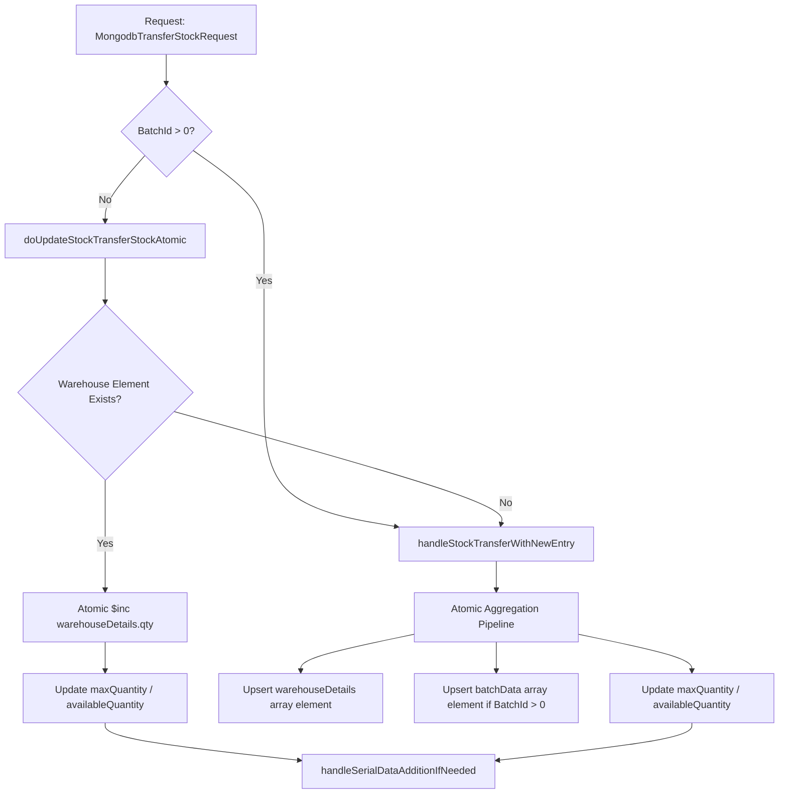
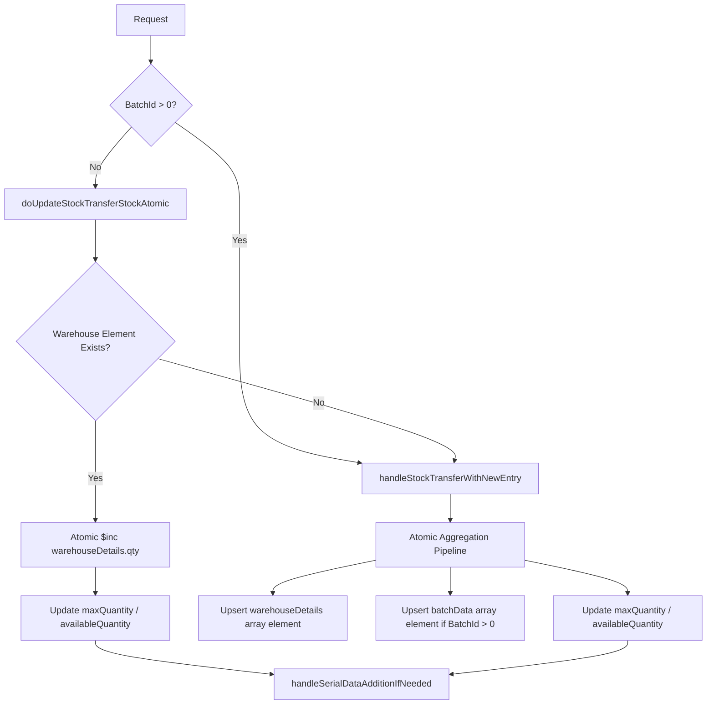

# Stock Transfer Flow Analysis - gemma-4-31b-it

## 1. Flow Diagrams

### Store-to-Store Transfer
(Simplified as the current implementation treats most transfers via `doUpdateStockTransferStockAtomic`)

### Warehouse-to-Warehouse Transfer
(The logic is identical to store-to-store as it operates on the `productId` and `warehouseId` level within a business context).

## 2. Issues Found

| # | Severity | Category | Summary | Evidence |
|---|---|---|---|---|
| 1 | High | Consistency | **Non-Atomic Multi-Step Update**: The `doUpdateStockTransferStockAtomic` method performs the warehouse update and the main quantity update in two separate MongoDB calls. If the second call fails, stock is inconsistent. | `ProductServiceImpl.java:2345` (warehouse update) $
ightarrow$ `ProductServiceImpl.java:2376` (qty update) |
| 2 | High | Race Condition | **Read-Modify-Write in Serial Handling**: `handleSerialDataAdditionIfNeeded` fetches the document, modifies the list in Java, and saves it back. This will overwrite concurrent updates to `serialData`. | `ProductServiceImpl.java:2627` (findOne) $
ightarrow$ `ProductServiceImpl.java:2670` (findAndModify/set) |
| 3 | Med | Validation | **Missing Negative Stock Check**: There is no validation to ensure `txnQty` (decrement) does not result in negative stock for the source warehouse/batch. | `ProductServiceImpl.java:2290` (simple sign flip) |
| 4 | Low | Schema | **Inconsistent Field Naming**: `MongodbTransferStockRequest` uses `toWareHouse` (capital H), while the logic in `ProductServiceImpl` refers to `warehouseDetails`. | `MongodbTransferStockRequest.java:16` vs `ProductServiceImpl.java:2312` |

## 3. Cited RAG Hits
- `mongodbsvc:src/main/java/com/oneshell/mongodb/feature/product/ProductServiceImpl.java`: "Atomic update failed (likely warehouseDetails doesn't exist), falling back to document fetch"
- `mongodbsvc:src/main/java/com/oneshell/mongodb/feature/product/ProductServiceImpl.java`: "Build atomic update ONLY for warehouse/batch/serial data... Quantity fields are updated in a separate step"
- `mongodbsvc:src/main/java/com/oneshell/mongodb/feature/transferStock/TransferStockService.java`: Interface definition for `saveTransferStock`.

## 4. Hindsight Results
- "stock transfer flow": No facts retrieved (Daemon failure).
- "transferStock bugs": No facts retrieved (Daemon failure).
- "warehouseDetails array MongoDB": No facts retrieved (Daemon failure).

## 5. Gaps
- **Concurrency Tests**: Need a test suite that triggers simultaneous transfers for the same product to validate the "Atomic" claims.
- **Negative Stock Scenarios**: Need sample data where transfer quantity exceeds available stock to see if the system allows negative inventory.
- **Serial Data Collision**: Need a test case where two different serials are added to the same product simultaneously.

## 6. Recommended Fix Order
1. **Fix Serial Data Race (Issue 2)**: Move serial additions to the atomic aggregation pipeline or use `$push`.
2. **Unify Quantity Updates (Issue 1)**: Move `maxQuantity` and `availableQuantity` updates into the same MongoDB operation as the warehouse update.
3. **Implement Stock Validation (Issue 3)**: Add a check to prevent negative stock during decrements.
4. **Standardize Naming (Issue 4)**: Align `toWareHouse` with `warehouseId`.
