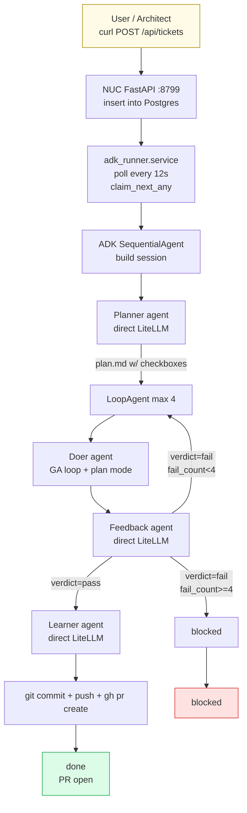
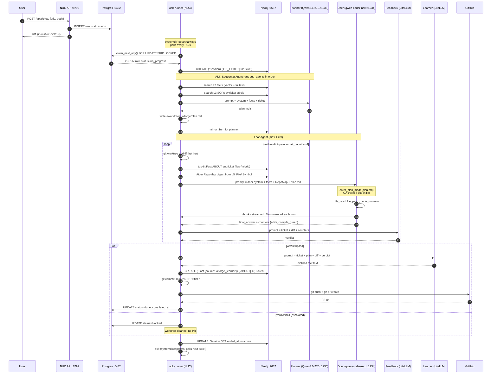
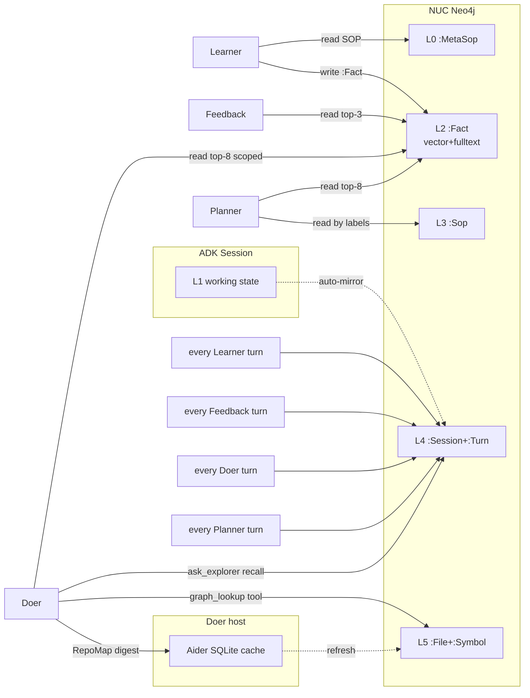
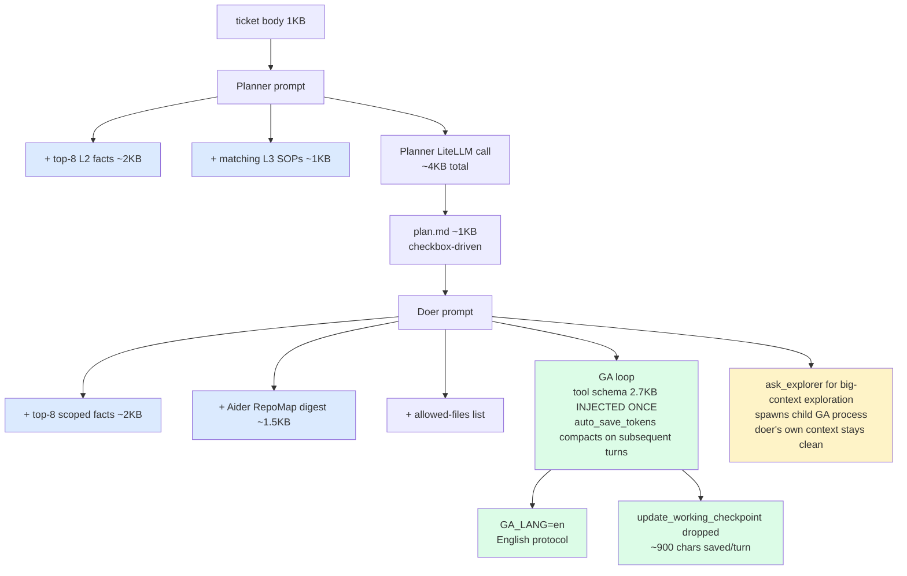
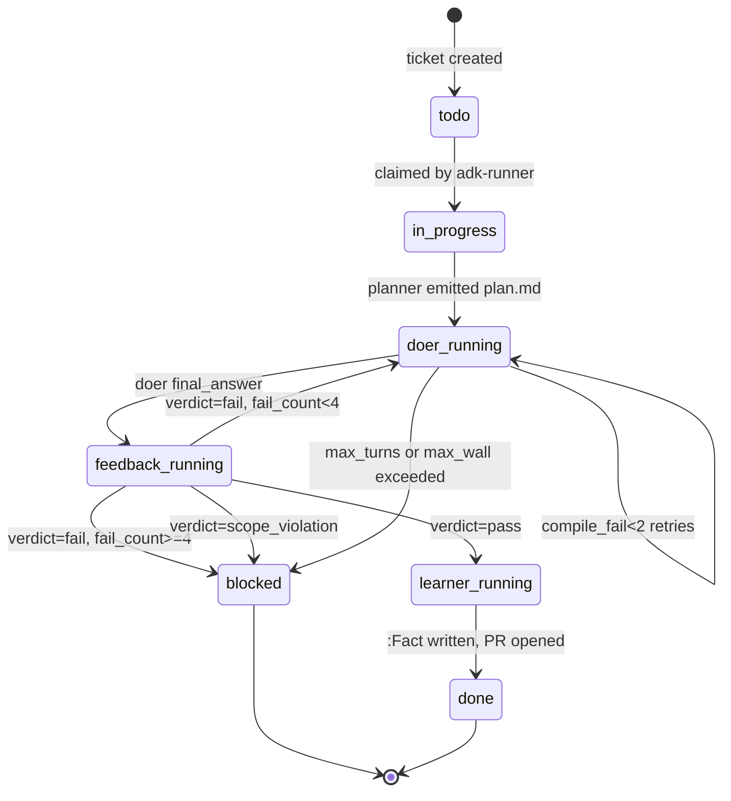
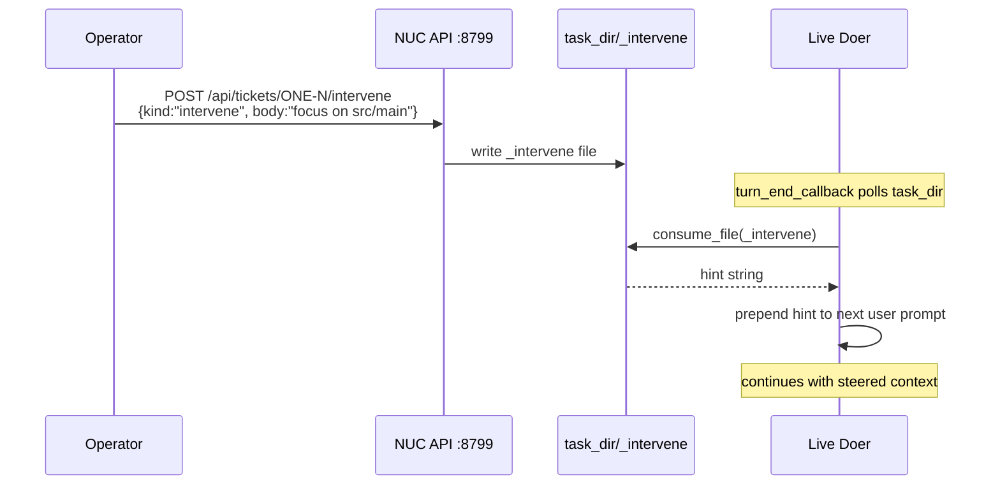
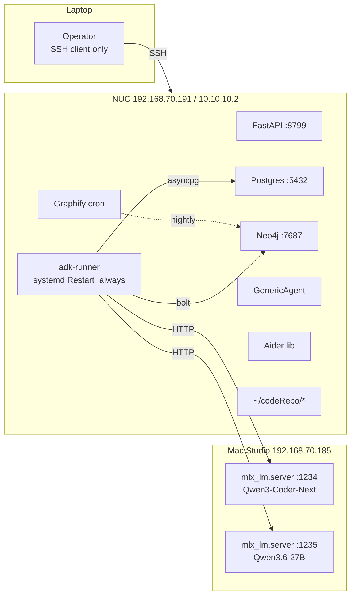

# Ticket Flow

End-to-end visual: from `curl POST /api/tickets` to PR-on-GitHub.

## High-level flow



## Detailed sequence (one ticket, happy path)



## Memory touch-points



## Optimization touch-points (where context shrinks)



## Failure paths



## Live intervention (steer a running agent)



## File / dir touchpoints during one run

```
NUC
├── /home/mani/codeRepo/PosClientBackend
│   ├── .aiforge/plan.md                     <- planner writes
│   └── .aiforge-worktrees/ONE-N/             <- doer's git worktree
│       └── src/main/java/.../X.java          <- doer edits
├── /home/mani/genericagent/temp/aiforge-ONE-N-<ts>/
│   ├── _intervene                            <- intervention API writes
│   ├── _keyinfo                              <- intervention API writes
│   └── _stop                                 <- intervention API writes
├── /home/mani/.aiforge/logs/graph-runner.err  <- all agent traces
├── Postgres                                   <- ticket row + events
└── Neo4j                                      <- :Session, :Turn, :Fact
```

## What runs where (host map)


